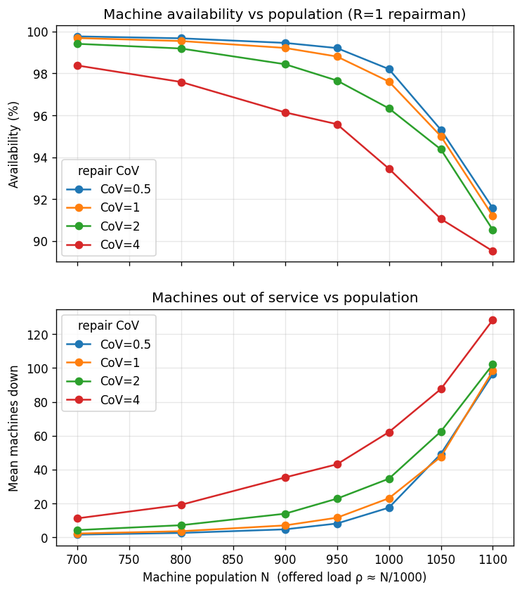

# Sample run — machine-repairmen

Captured from a live `qsim-service` on `http://localhost:8080`, full sweep
(7 populations × 4 repair-CoV values × 10 independent seeds = 280 simulations,
each point the mean over seeds 1…10). The three drivers (`bash`, `python`, `go`)
produce identical numbers for a given `(N, CoV)` — same model, same seeds — so
only one table is shown; the plot is generated by the python driver.

## Table

```
     N    rho    CoV   Avail(%)       Down
   700   0.70    0.5      99.77       1.65
   700   0.70      1      99.69       2.28
   700   0.70      2      99.41       4.32
   700   0.70      4      98.38      11.23
   800   0.80    0.5      99.67       2.64
   800   0.80      1      99.54       3.66
   800   0.80      2      99.19       7.20
   800   0.80      4      97.59      19.24
   900   0.90    0.5      99.45       4.76
   900   0.90      1      99.21       7.08
   900   0.90      2      98.44      13.98
   900   0.90      4      96.14      35.38
   950   0.95    0.5      99.21       8.19
   950   0.95      1      98.80      11.63
   950   0.95      2      97.66      22.86
   950   0.95      4      95.58      43.14
  1000   1.00    0.5      98.21      17.55
  1000   1.00      1      97.61      23.10
  1000   1.00      2      96.33      34.64
  1000   1.00      4      93.45      62.16
  1050   1.05    0.5      95.31      49.31
  1050   1.05      1      95.00      47.55
  1050   1.05      2      94.37      62.51
  1050   1.05      4      91.05      87.56
  1100   1.10    0.5      91.57      96.29
  1100   1.10      1      91.19      98.29
  1100   1.10      2      90.53     102.14
  1100   1.10      4      89.52     128.39
```

- `N` — machine population; `rho` — offered load ρ ≈ N/1000.
- `CoV` — coefficient of variation of the repair time (the curve family).
- `Avail(%)` — time-average fraction of machines up = `100 × queue-length@running / N`.
- `Down` — mean number of machines out of service = `queue-length@repair`.

> **Why the two columns don't sum to N.** Physically `running + repair = N` at
> every instant, so their time-averages must too. But the service estimates the
> two station queue-lengths as **independent** measures, each with its own
> confidence interval and its own Monte-Carlo sampling error, so in a finite run
> `Avail% × N/100 + Down` need not land exactly on `N` — and the residual even
> changes sign across rows (e.g. at N=1050 it lands ~5 machines under N at CoV=1
> but ~3 over at CoV=2). The gap is small in the light-load regime and grows with load
> and with repair CoV (heavier-tailed service → noisier repair-queue estimate),
> reaching ~13 machines at the overloaded, heavy-tailed corner N=1100/CoV=4.
> Averaging the 10 seeds shrinks it (a single seed's gap is several times
> larger); it is genuine estimator noise, not an inconsistency in the model.

## Plot



## Reading the result

As load rises toward and past the single repairman's capacity (ρ → 1),
availability falls and the number of machines waiting for repair climbs. The
teaching point is the **effect of repair-time variability**: higher repair CoV
means lower availability and more machines down. Availability is cleanly ordered
by CoV at every load level; machines-down is too, apart from one near-knee
wobble (at N=1050 the CoV=0.5 and CoV=1 points sit within ~2 machines of each
other and swap order) — the kind of residual sampling noise that persists near
the knee even at 10 seeds, and a reminder that these are Monte-Carlo estimates,
not closed-form values. The gap between the curves widens through the knee. The
effect is muted on availability (a few percentage points — downtime is small
next to a 1000-unit mean time to failure) but pronounced on the queue itself: at
N=900 the mean machines-down runs from ~4.8 at CoV=0.5 to ~35 at CoV=4 (a ~7×
fan-out), and at N=1000 from ~17.6 to ~62 (~3.5×). This is the
Pollaczek–Khinchine intuition — waiting scales with `(Ca² + Cs²)/2` — made
visible: with exponential failures the repair-time variance `Cs²` is the term
that moves the queue.

Because a single-server FCFS station with general (non-exponential) service is
not a product-form network, there is no exact closed-form solution for CoV ≠ 1 —
which is exactly why the numbers above come from simulation. Every run in this
sweep returned `completed: true` (converged within the stopping criteria); had
any failed to converge, the drivers would have aborted rather than report a
partial figure.
